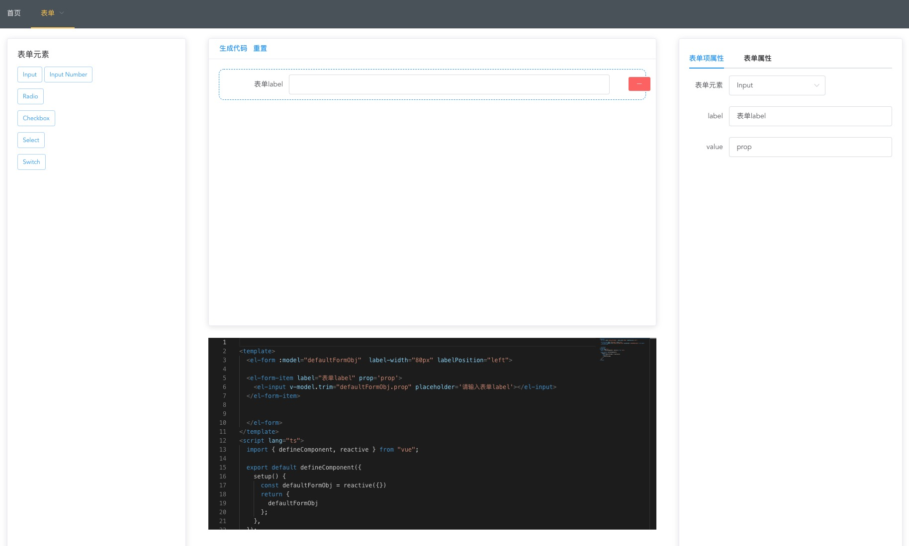

<h1 align="center">Welcome to easy-view 👋</h1>

> element-ui 的模板代码生成的工具

### 参考项目

- https://github.com/Liugq5713/vue-element-nocode-admin

本项目的技术栈

- vue3
- typescript
- element-plus
- tailwindcss
- monaco-editor
